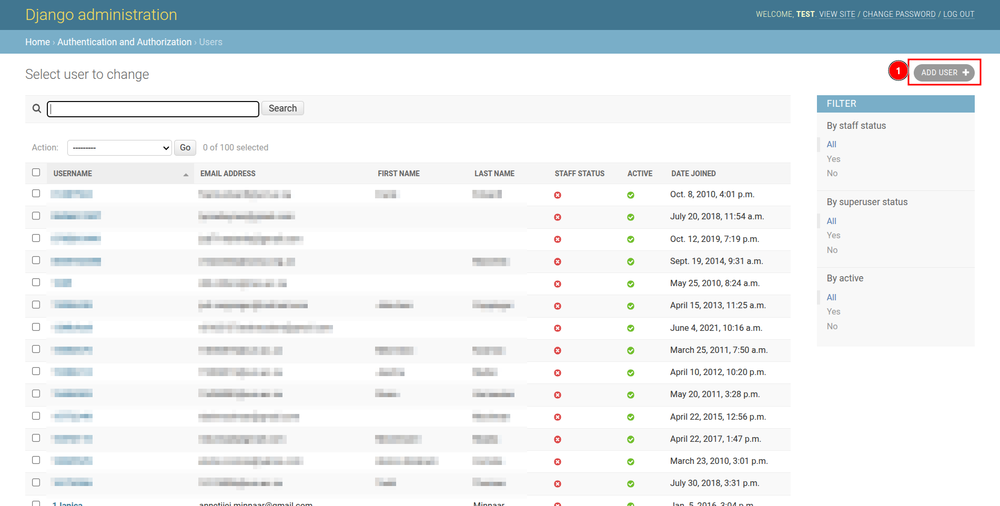

# How to add record to the table?

After accessing the admin page, locate the desired table where you want to add a record. Then, click on the 1️⃣ `+Add` button, which will redirect you to the add record page, allowing you to enter and save the new record.

## How to add user?

First, locate the users table. Then, click on the 1️⃣ `+Add` button to add a new user, this will directly redirect you to the add user page. Alternatively, you can click on the 2️⃣ `Table Name`, which acts as a link, redirecting you to the table records page, where you can explore existing records and can use the `Add User` button to add a new record.

Click on the 1️⃣ `Add User` button to add a new user. This button will redirect you to the add user page.

To create a new user, you need to fill in the 1️⃣ `Form` with the required details. After this, you can either manually complete the 2️⃣ `Form` or left them empty to be filled automatically during user verification. Once all necessary details are entered, you have multiple options: click on 3️⃣ `Save and add another` to save the current record and be redirected to the add user page for adding another user, click on 4️⃣ `Save and continue editing` to save the current record while continuing to edit it, or use the 5️⃣ `Save` button to save the current record and exit the form.

### Error

You will receive the following 1️⃣ `Error` if you forget to fill in the required fields and click on the `Save` button.

