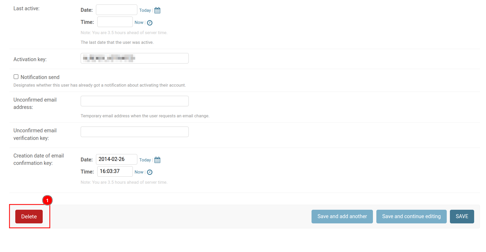
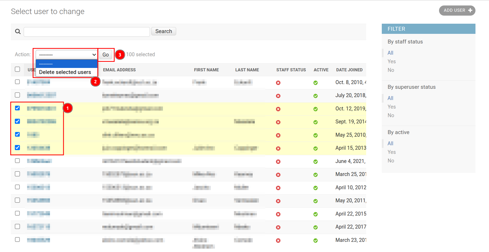
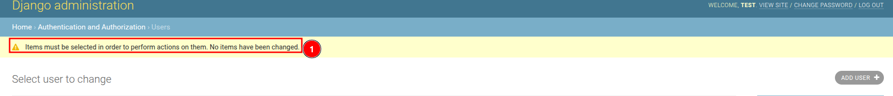

# How to remove record?

To update a record in any table, click on the 1️⃣ `Table Name` of the desired table, which works as a link and redirects you to the table page, where you can select the specific record you want to remove.

## How to remove user?

### Remove single record

Click on the 1️⃣ `USERNAME` of the corresponding user you want to remove. This username works as a link and redirects you to the user page.

Scroll down to the bottom and click on the 2️⃣ `Delete` button. This will redirect you to the delete confirmation page.

To delete the record, click on the 1️⃣ `Yes, I'm sure` button. Otherwise, click on the 2️⃣ `No, take me back` button to cancel the process and be redirected to the previous page.

### Remove multiple record

To remove records, select them by checking the 1️⃣ `Checkboxes` next to the corresponding users. You can also choose a single user. Then, click on the 2️⃣ `Actions` dropdown, select `Delete selected user`, and click on the 3️⃣ `Go` button to proceed. This will redirects you to the delete confirmation page.

To delete the record, click on the 1️⃣ `Yes, I'm sure` button. Otherwise, click on the 2️⃣ `No, take me back` button to cancel the process and be redirected to the previous page.

### Warning

You will receive the following 1️⃣ `warning` if you click on the `Go` button without selecting any items.

