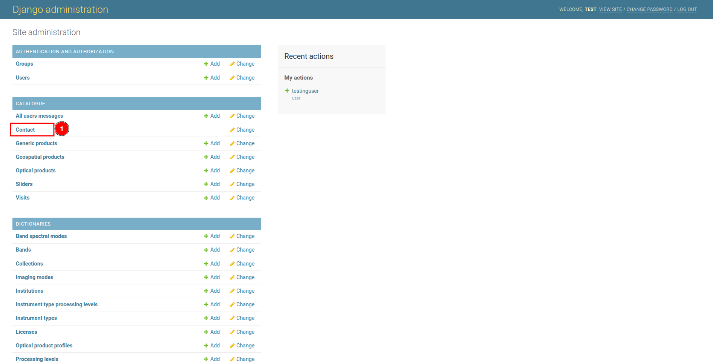
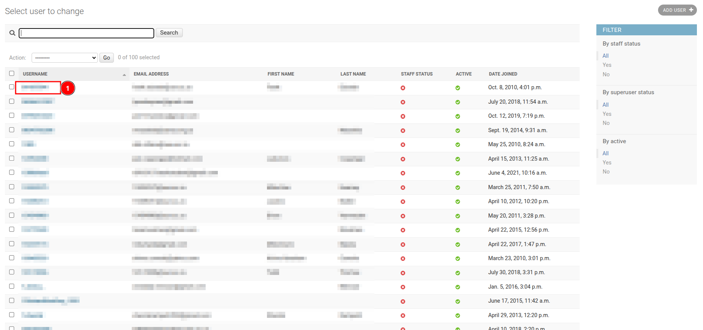
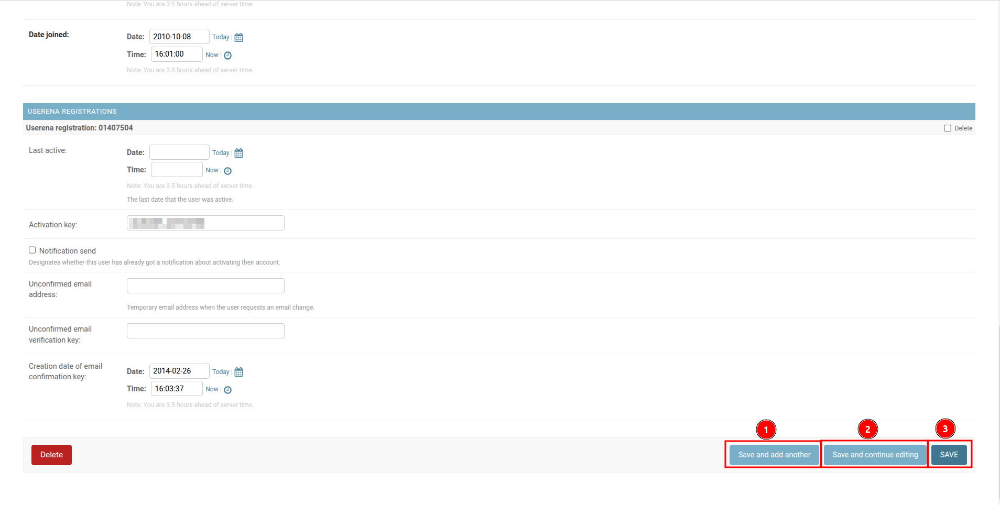

# How to update record?

To update a record in any table, click on the 1️⃣ `Table Name` of the desired table, which works as a link and redirects you to the table page, where you can select the specific record you want to update.

## How to update user?

Click on the 1️⃣ `USERNAME` of the user you want to update. This username works as a link and redirects you to the edit page.

Fill the necessary details you want to update. Once all necessary details are entered, you have multiple options: click on 1️⃣ `Save and add another` to save the current record and be redirected to the add user page for adding another user, click on 2️⃣ `Save and continue editing` to save the current record while continuing to edit it, or use the 3️⃣ `Save` button to save the current record and exit the form.

