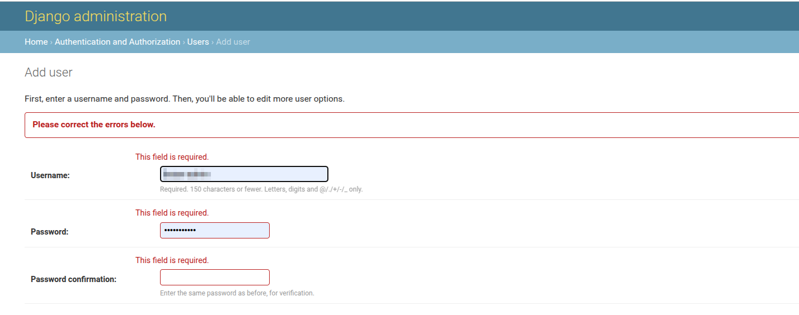

# Add record to the table

## Add User

The administrators will be presented with a form to enter the user's information. Here are the fields to fill in:

1. **Username**: Administrators should enter a unique username for the new user. It should be 150 characters, or less, and may contain only letters, digits, and the characters '@', '.', '+', '-', and '_'.

2. **Password**: Administrators should create a strong password for the user. 

3. **Password Confirmation**: Administrators should re-enter the same password for verification.

>Note: Above details are must be filled to create a new user.

1. **Last active:** This field will automatically be filled with the date and time when the user last logged in.

2. **Activation key:** This field will automatically be filled with a unique key that will be sent to the user's email address.

3. **Notification send:** Designates whether this user has already got a notification about activating their account.

4. **Unconfirmed email address:** Temporary email address when the user requests an email change.

5. **Unconfirmed email verification key:** Temporary email verification key.

6. **Creation date of email Confirmation key:** Date and time when the email confirmation key was created.

7. **Save and add another**: Save the current record, then redirect to a new page to add a new record.

8. **Save and continue editing**: Save the current record while still showing the current record.

9. **Save**: Save the current record, then redirect to the Django Admin Table/record list.

### Error

* Users will receive the following error if they forget to fill in any of the required fields.
