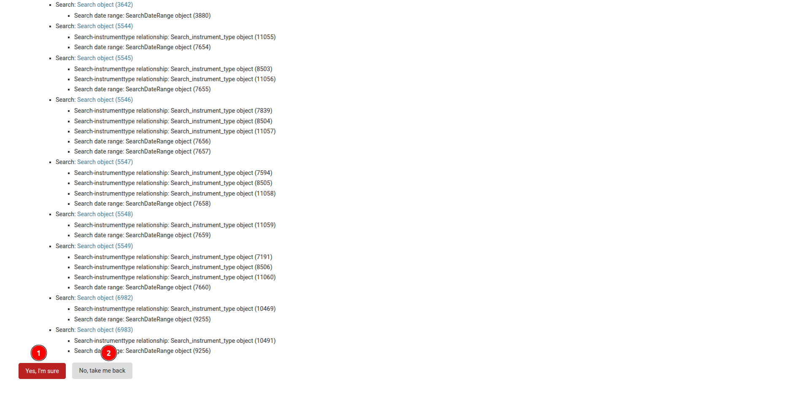

# Remove record from the table

## Remove User

### Remove Single User

1. **USERNAME:** Users can access any user's details by clicking on their name in the table. The username acts as a link that redirects them to the information page.

1. **Delete:** At the bottom of the page, users will find the `Delete` button. Clicking on this button users will be redirected to the delete confirmation page.

    

    1 **Yes, I'm sure:** Click on this button to delete the record.

    2 **No, take me back:** Click on this button to go back to the previous page.

### Remove Multiple Users

1. **Select Users:**  Users can select multiple users by checking the boxes next to their names. They also have the option to select all users at once by checking the box at the top of the table or proceed with selecting a single user.

2. **Actions:** Click on the `Actions` dropdown menu and select `Delete`.

3. **Go:** Click on the `Go` button to proceed with the deletion. Users will be redirected to the delete confirmation page.

    
    
    1 **Yes, I'm sure:** Click on this button to delete the record.

    2 **No, take me back:** Click on this button to go back to the previous page.

## Warning

1. **Warning:** Users will receive this warning if they click on the `Go` button without selecting any users.
