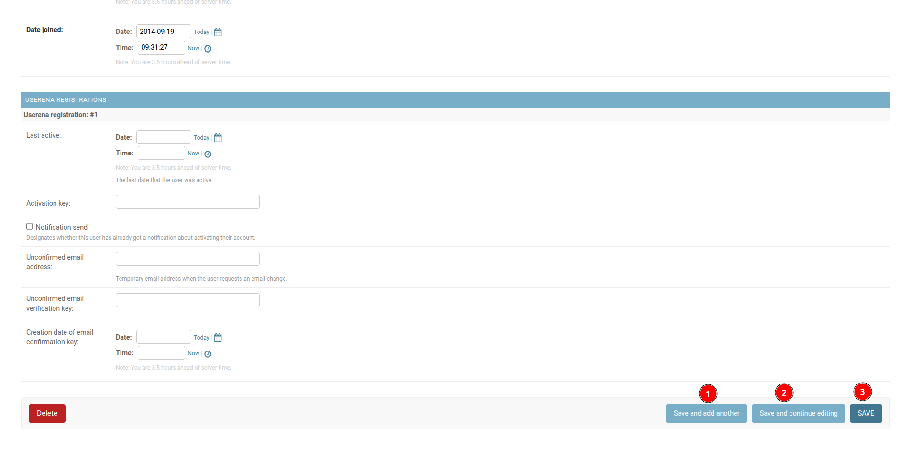

# Update record to the table

## Update User Details

1. **USERNAME:** Click on the username of the respective user to update their details. The username works as a link, redirecting the admin to the user's information page.

    
    

    1 **Save and add another:** After filling in the user's updates details click on this button to save the changes and users will redirected to the add user page.

    2 **Save and continue editing:** Click on this button to save the changes and continue editing the user's details.

    3 **Save:** Click on this button to save the changes.
