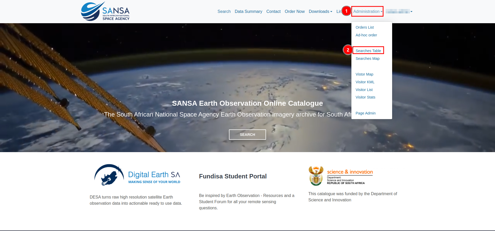
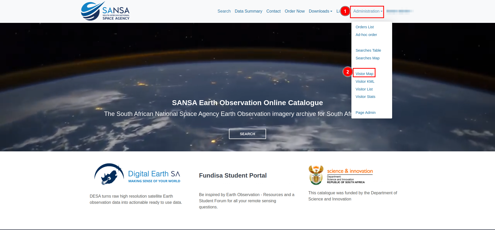
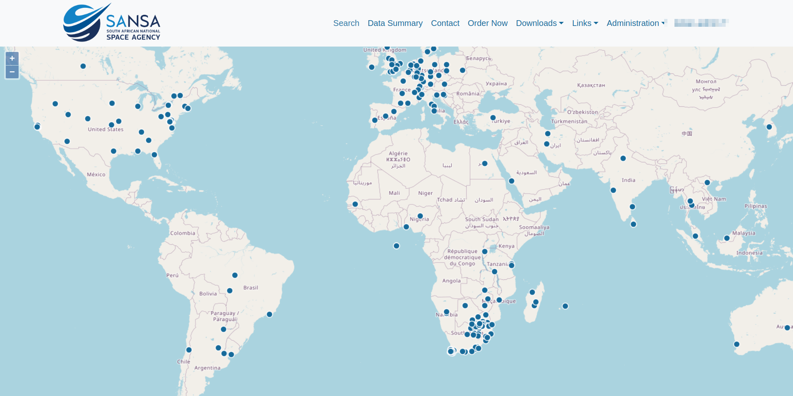
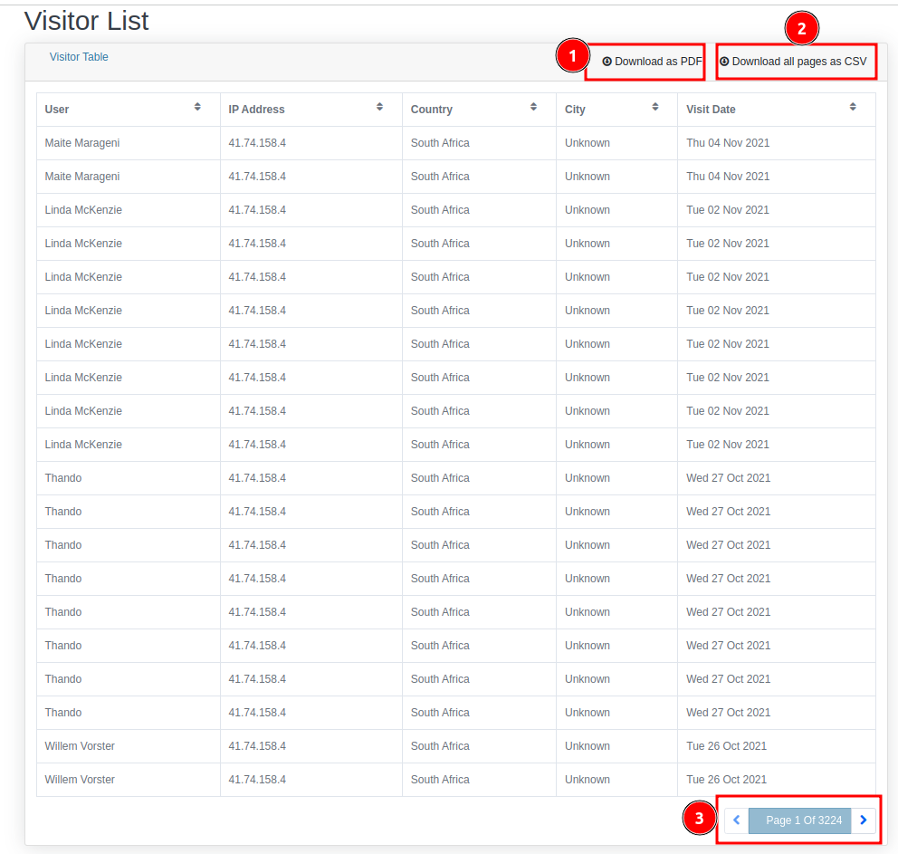

# Administration

You can access the administration functionalities by clicking on 1️⃣ `Administration` in the top navigation bar. This will open a 2️⃣ `dropdown` menu, allowing you to access various features such as `Order Lists`, `Ad-hoc Orders`, `Searches`, and more. 

## How to access the order list?

To access the order list, click on 1️⃣ `Administration`, then select 2️⃣ `Order List` from the dropdown menu. This will redirect you to the order list page.

The `Orders List` allows you to manage and track your orders efficiently. You can download the list as a PDF by clicking the 1️⃣ `Download as PDF` button. To review reports, use the 2️⃣ `View Monthly Reports` option, where you can switch between the previous and next months or download the report as a PDF. The 3️⃣ `Orders Summary` provides a concise overview of all orders, which can also be downloaded as a PDF for easy reference. You can sort the data in the ascending or descending order by clicking on the 4️⃣ `Column header` of the respective column. The data table displays crucial order details such as ID, date, user, and status. 

You can click on 5️⃣ `View Details` to access more information about a specific order, which will redirects you to the specific order page from where you can remove those order as per your requirements. Navigation through large lists is made easy with 6️⃣ `pagination` (`<` and `>` buttons), and if you are looking for a specific order, enter the name in the 7️⃣ `search field` and click `Go`.

## How to access the ad hoc order?

To access the ad hoc order, click on 1️⃣ `Administration`, then select 2️⃣ `Ad hoc order` from the dropdown menu. This will redirect you to the ad hoc order page.

The `Ad-hoc Order` feature allows you to create custom orders by filling in specific details. First, fill the 1️⃣ `Form`. If you need to add a new row, click on 2️⃣ `Add new row`. To save your progress, use the 3️⃣ `Save` button. Once all details are filled in, submit the form by clicking on the 4️⃣ `Submit` button. 

# How to access search table?

To access the `Searches Table`, click on 1️⃣ `Administration`, then select 2️⃣ `Searches Table` from the dropdown menu. This will redirect you to the  searches table page.

The `Searches Table` keeps a record of your recent search history, enabling you to track and manage past queries. You can refine the search history by clicking on 1️⃣ `User Country of Origin`. To download the data as a PDF, click on 2️⃣ `PDF`. Additionally, you can filter the data based on the searched country by clicking on 3️⃣ `Countries Searched`. To search for data directly on the map, use the 4️⃣ `Search` icon of the respective field. If you wish to remove a record from the search history, click on the 5️⃣ `x` icon of the respective record. 

# How to access searches map?

To access the `Searches Map`, click on 1️⃣ `Administration`, then select 2️⃣ `Searches Map` from the dropdown menu. This will redirect you to the searches map page.

# How to access visitor map?

To access the `Visitor Map`, click on 1️⃣ `Administration`, then select 2️⃣ `Visitor Map` from the dropdown menu. This will redirect you to the visitor map page.

the `Visitor Map` displays the geographical locations of users who have accessed the platform. You can zoom in and out using the `+` and `-` buttons for better navigation.

# How to access the visitor list?

To access the `Visitor list`, click on 1️⃣ `Administration`, then select 2️⃣ `Visitor List` from the dropdown menu. This will redirect you to the visitor list page.

You can download the data as a PDF by clicking on 1️⃣ `Download as PDF`. Alternatively, you can download the data in CSV format by clicking on 2️⃣ `Download all pages as CSV`. To navigate through different pages, use the 3️⃣ `pagination` controls.

# How to access the visitor stats?

To access the `Visitor Stats`, click on 1️⃣ `Administration`, then select 2️⃣ `Visitor Stats` from the dropdown menu. This will redirect you to the visitor stats page.

# How to access admin page?

To access the `Admin Page`, click on 1️⃣ `Administration`, then select 2️⃣ `Admin Page` from the dropdown menu. This will redirect you to the admin page.

You can refer to the [manual](../manual/administration.md) for a detailed description.
