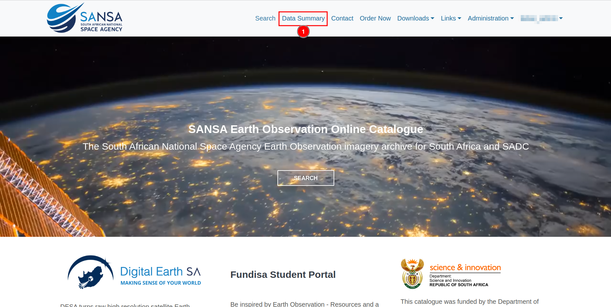
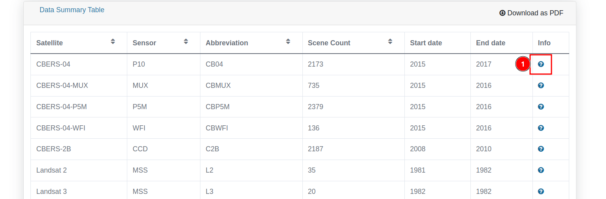

# Data Summary

You can access the data summary page by clicking on the 1️⃣ `Data Summary` from the top navigation bar.

You can open the `Chart context menu` by clicking on the 1️⃣  icon. This will provide options to print the chart or download it in different formats (XML, JPEG, PNG, etc.). You can view different records gathered by sensors in the 2️⃣ `Pie Chart`, where different colours represent different sensors.

If you want to download the summary data, you can do so by clicking on the 1️⃣ `Download as PDF` button, which will download the data in PDF format. You can view the data in the 2️⃣ `Table`, you can navigate through the pages by using the 3️⃣ `Pagination`.

## How to access the Sensor Summary Fact Sheet?

You can access the sensor summary fact sheet by clicking on the 1️⃣  `icon`, this will redirects you to the `Sensor Summary Fact Sheet` page.

You can view the references for the data by clicking on the 1️⃣ `Reference` link, which will redirect you to the page from where the data was collected. You can go back to the previous page by clicking on the 2️⃣ `Back` button. If you want to download the data, you can do so by clicking on the 3️⃣ `Download as PDF` button, which will download the data in PDF format.

You can prefer [manual](../manual/data-summary-page.md) for better understanding.
