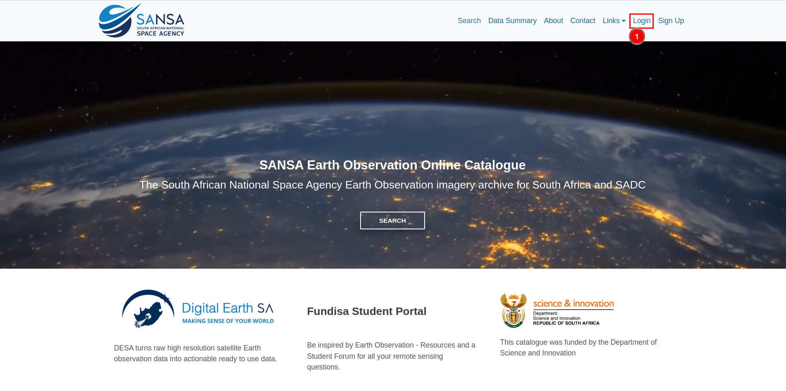
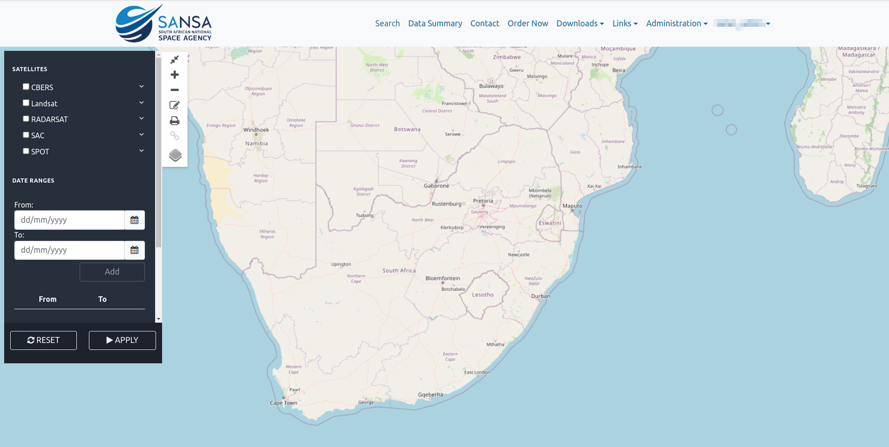

# Login

>Note: You can use your username or email in the username field.

You can log in to the platform by clicking on the 1️⃣ `Login` link provided in the navigation bar. This will redirect you to the login page.

You are required to enter your name in the 1️⃣ `Username` field and your password in the 2️⃣ `Password` field. After filling in all the details, you can submit the form by clicking on the 3️⃣ `Login` button.

You will receive the following 1️⃣ `Error` if any of the fields you filled in are incorrect.

After submitting the login request successfully you will be redirected to the search page.

