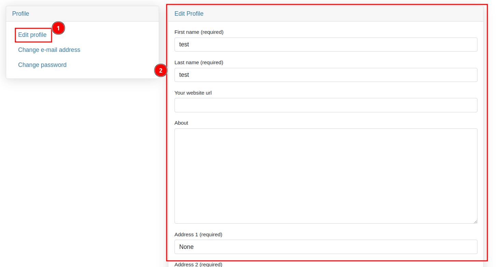
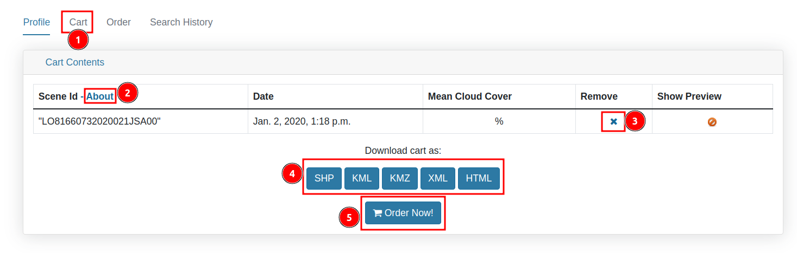
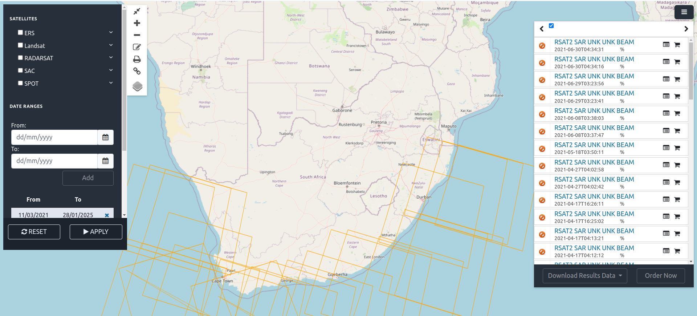

# Profile Page

You can access the profile page by clicking on your 1️⃣ `Username` in the top navigation bar. This will open a dropdown menu where you can click on 2️⃣ `Profile` to view your profile. Alternatively, you can click on 3️⃣ `Logout` to log out from the site.

## How to access personnel details?

Click on the 1️⃣ `Profile` tab to access your personal details (this tab is selected by default). Here, you can perform various operations such as editing your profile, resetting your password, and changing your email from the 2️⃣ `Profile` section. Additionally, you can view your personal details in the 3️⃣ `Account Details` section.

### How to edit profile?

Click on the 1️⃣ `Edit Profile` option, then fill in the required details in the 2️⃣ `Edit Profile` form. Scroll down to the bottom of the form and click on the `Save changes` button to update your profile details.

### How to change email address?

Click on the 1️⃣ `Change e-mail address` option, then enter your updated email in the 2️⃣ `Email` field. Finally, click on the 3️⃣ `Send confirmation` button to submit the request.

### How to change password?

Click on the 1️⃣ `Change password` option, then enter your old password in the 2️⃣ `Old password` field. Next, enter your new password in the 3️⃣ `New password` field, and re-enter it in the 4️⃣ `Confirm password` field. Finally, click on the 5️⃣ `Submit` button to submit the request.

## How to access cart details?

Click on the 1️⃣ `Cart` tab to access your cart details. In this section, you can view the cart details. To learn more about the cart, click on 2️⃣ `About`. You can remove items from the table by clicking on the 3️⃣ `x` button. Additionally, you can download the cart by selecting a 4️⃣ `Download format` such as SHP, KML, or HTML. To place an order, click on the 5️⃣ `Order Now!` button, which will redirect you to the order page.

* To know more about the order now page, please check [manual](../manual/profile-page.md#order-options).

## How to access order page?

To access the order page, click on the 1️⃣ `Order` tab. You can download the order as a PDF by clicking on 2️⃣ `Download as PDF` button. To search for a specific order, enter the order name in the 3️⃣ `Input` field and click on the 4️⃣ `Go` button to search.

## How to access search history?

You can access the search history page by clicking on the 1️⃣ `Search History` tab. The available data is displayed in a table. To view more details about a specific record, click on the 2️⃣ `Search` icon next to it, which will redirect you to the search page. You can also remove a record from the search history by clicking on the 3️⃣ `x` button in the respective field.

* This is how the search page looks like.

    

    * To know more about the search page click [here](../guide/search-page.md).
