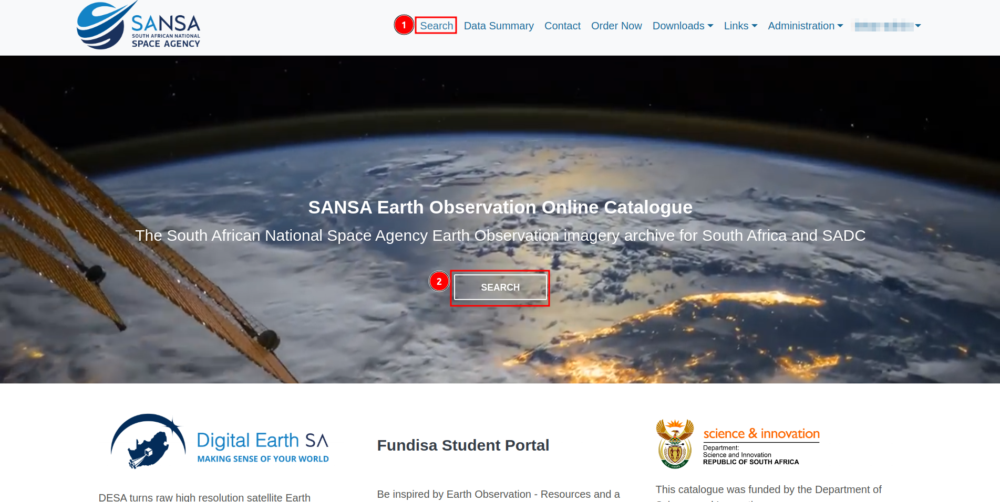
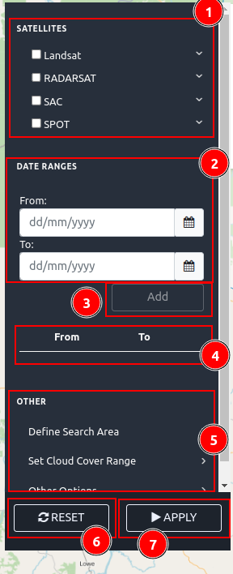
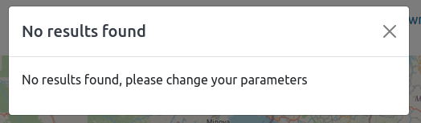

# Search Page

You can access the search page by clicking on the 1️⃣ `Search` option in the navigation bar or by clicking on the 2️⃣ `SEARCH` button in the middle of the page. Both options will redirect you to the search page.

You can access various functionalities to explore the map. You can apply different parameters by clicking on the 1️⃣  icon, this icon hide/show the filter menu. You can zoom in and zoom out using the 2️⃣ `➕` and 3️⃣ `➖` icons. Use the 4️⃣  icon to draw a polygon on the map. To download the map in PNG format, click on the 5️⃣  icon. After drawing a polygon, you can copy the link by clicking on the 6️⃣  icon. To change the type of map, click on the 7️⃣  icon.

## How to apply parameters?

First, you need to select the 1️⃣ `SATELLITES` type by checking the checkbox of the respective satellite. If you want to select a specific satellite, you can do so by clicking on the satellite type, which will open the dropdown menu. Then, check the checkbox of the respective satellite. If no satellite is selected, all satellites are selected by default. Then, select the 2️⃣ `DATES RANGES` (from and to) by clicking on the respective fields. After this, click on the 3️⃣ `Add` button to add it to the 4️⃣ `From/To` field. You can access additional options from the 5️⃣ `OTHER` section. Once all necessary details are filled in, apply them by clicking on the 7️⃣ `APPLY` button or you can reset the form using the 6️⃣ `RESET` button.

* You will encounter the following error if you forget to fill in either of the date fields.

    

* You will encounter this alert message, if no data is found based you search results.

    

### Result Data

After successfully retrieving the data, this menu will appear. You can use the 1️⃣  icon to hide this menu. To access the metadata of any specific result, click on the 2️⃣  icon. This will open a pop-up window containing the metadata of the particular result. 

* You can see the available data in the 1️⃣ `Data` as shown in the below image.

    

## How to draw polygon?

Users are required to click on the 1️⃣ `Draw polygon` icon to draw the polygon, then points the locations on which you want to draw the polygon then to end the drawing click on the last point.

For better understanding you can use [manual](./search-page.md).
