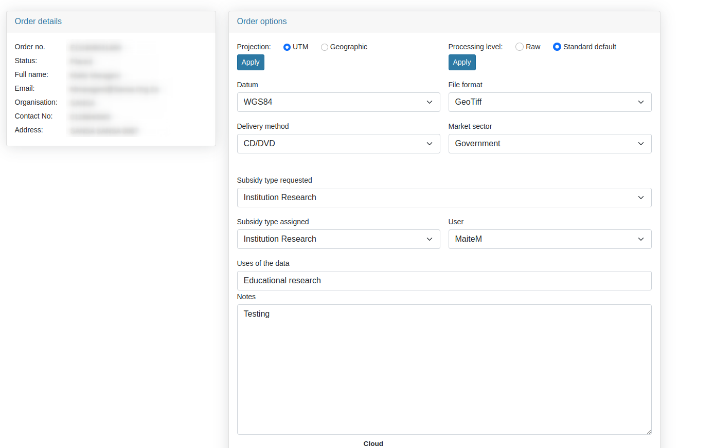
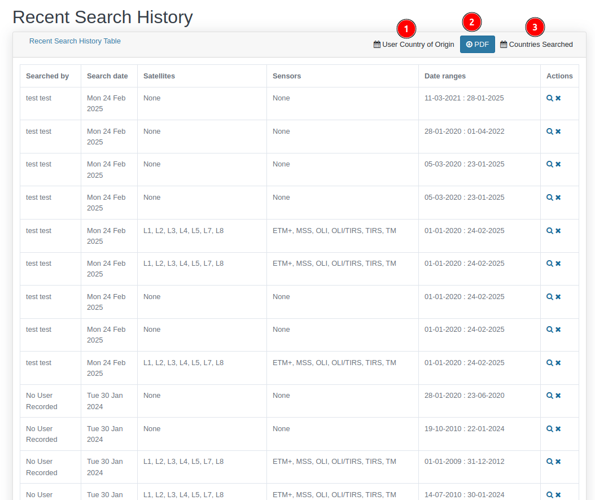

# Administration

1. **Administration:** Users can access admin functionalities by clicking on this dropdown menu, which allows them to navigate through various admin options.

* **Orders List:** Users can access the orders list by clicking on this option.

    

    **1 Download as PDF:** Users can download the orders list as PDF by clicking on this button. This is how the download file look like:

    

    **2 View Monthly Reports:** Users can view monthly reports by clicking on this option.

    

    **1. Previous Month:** Users can view the previous month's report by clicking on this option.

    **2. Next Month:** Users can view the next month's report by clicking on this option.

    **3. PDF:** Users can download the monthly report as PDF by clicking on this button.

    **3 View Orders Summary:** Users can view orders summary by clicking on this option.

    

    **1. Download as PDF:** Users can download the orders summary as PDF by clicking on this button.

    **4 Data:** This table displays data, including details such as ID, order date, user, status, and more.

    **5 View Details:** Users can view the details associated with the particular order by clicking on this button.

    
    

    * ** Icon:** Users can use this icon to remove the product from the order.

    **6 Pagination:** Pagination allows users to navigate through the data by clicking on the `<` and `>` buttons.

    **7 Go:** Users can search for a specific order by entering the order name in the input field and clicking the `Go` button.

* **Ad-hoc order:** Users can make an ad hoc order by clicking on thus link.

    

    ## Form Fields

    * **Market Sector:** Dropdown to select the market sector.
        - Example: `Academic - Staff Research`.

    * **Subsidy Type:**
        - **Subsidy type requested**: Dropdown for selecting the requested subsidy.
        - **Subsidy type assigned**: Dropdown for assigning a subsidy.

    * **User Selection:** Input field for selecting the user who made the request.
        - Example: `0606612307`.

    * **Notes:** Text area for additional comments or request details.

    ## Product Details Table

    - Fill the necessary details in the form.
    
    ### Actions:

    - **Add new row**: Allows users to add more products.
    - **Save**: Saves the form data.
    - **Submit**: Submits the form.

* **Searches Table** This menu will show all recent search history.

    

    1. **User Country of Origin:** The User country origin shows the country of the visiting user in this month. 

    2. **PDF:** Allows users to download the search history as the PDF.

    3. **Countries Searched:** Users can use this option to modified the search history on the basis of the countries searched.

    4. ** Icon:** After clicking on this, users will be redirected to the search page of the corresponding search history.

    5. ** Icon:** Allow users to remove the respective search history.

* **Search Map:** Users can use this link to view the search history on the map.

* **Visitor Map:** Users can view the countries from which visitors have accessed the platform.

    

    - Users can use `+` and `-` buttons to zoom in and zoom out on the map.

* **Visitor List:** Users can access the visitors list by clicking on this link.

    

    1. **Download as PDF:** Allows users to download the data in the PDF format.

    2. **Download all pages as CSV:** Allows users to download the data in the CSV format.

    3. **Pagination:** Allows users to navigate through the pages. Users can use `<` and `>` buttons to navigate through the pages.

* **Visitor Stats:** Allows users to view the visitor stats in the chart format at well as in table format.

    

    - **Chart:** In this chart, users can see different colours representing various countries. The legend helps identify which colour corresponds to each country. Additionally, users can view the percentage of visitors from each country by hovering over the respective colour on the chart.

    - **:** Users can also download the chart in the different formats by clicking on this icon. These are the available options:

        

    

    1. **Download as PDF:** Allows users to download the visitor stats in PDF format.

    2. **View Monthly Reports:** Users can also view the monthly reports by clicking here.

    3. **Column Name:** Users can arrange the data in ascending or descending order by clicking on the column name.

* **Page Admin:** Allows users to access the admin page.
