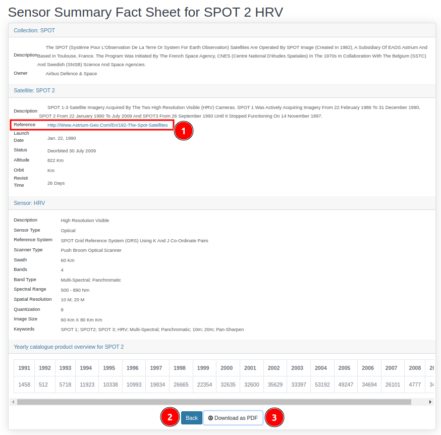

# Data Summary

1. **Data Summary:** Users can click on this link to access the data summary page.

1. ** Chart Context Menu:** Users can click on this icon to access the chart context menu. This menu contains several options, such as printing the chart and downloading it in different formats (e.g., XML, PNG, etc.).

    

2. **Pie Chart:** Users can view the visual representation of records in this pie chart.

    

3. **Download as PDF:** User can use this button to download the data in the PDF form.

## Data Summary Table

* **Table:** Users can view the information related to the data in this data summary table.

* **Pagination:** Users can use this pagination to navigate through the pages. Users can use `<` and `>` button to navigate.

    

## Records by Sensor Chart

This pie chart provides an insightful `visual summary` of the data collected by various sensors, making it easy for users to understand the distribution and dominance of different sensors in the dataset.

### Chart Details

- The chart is titled `Records by Sensor`.
- Each slice of the pie represents a different sensor.
- A tooltip appears when hovering over a slice, showing the `sensor name` and the `percentage` of records it holds.

    

- The `legend` at the bottom provides a reference for all sensors and their corresponding colours.

### Sensors Represented
The following sensors are included in the chart:

- **CBERS-04 - P10**
- **LS-4 - MSS**
- **RSAT2 - SAR**
- **SPOT-6 - NAOMI**
- **CB04MUX - MUX**
- **LS-5 - TM**
- **SCC - MMRS**
- **SPOT-7 - NAOMI**
- **CBERS-04-P5M - P5M**
- **LS-5 - MSS**
- **SPOT-1 - HRV**
- **ZASat-002 - MSI**
- **CBERS-04-WFI - WFI**
- **LS-7 - ETM**
- **SPOT-2 - HRV**
- **CBERS-2B - CCD**
- **LS-2 - MSS**
- **LS-8 - OLI**
- **SPOT-4 - HRVIR**
- **LS-3 - MSS**
- **LS-8 - OLI_TIRS**
- **SPOT-5 - HRG**

### User Interaction

- Users can `hover` over each section to view the corresponding percentage.
- The `legend` helps identify each sensor's colour in the chart.

## Sensor Summary Fact Sheet 

1. ** Icon:** Users can open the `Sensor Summary Fact Sheet` by clicking on this icon corresponding to the respective record.

    

    **1 Reference:** Users can use this link to check from whether the reference has been taken for this data.

    **2 Back:** Allows users to go back to the previous page.

    **3 Download as PDF:** Users can download this sheet as a PDF by clicking on this button.

## Print Chart

1. **Destination:** Users can choose different destination types to print the chart, with PDF being the default option.

2. **Pages:** Users are required to select the number of pages they want to print, by default all pages are selected.

3. **Layout:** Users can choose between portrait and landscape layouts for printing.

4. **Cancel:** By clicking on this button users can cancel the process.

5. **Save:** Users can use this button complete the printing process.
