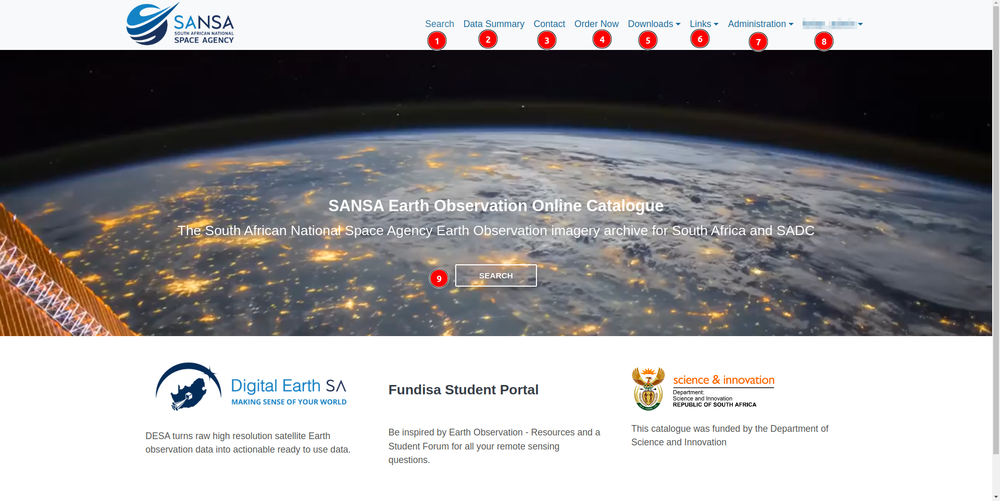

# Landing Page

Welcome to `SANSA Catalogue`, your gateway to seamless geospatial data management and exploration.

## Prior to Login

Upon initial interaction with the platform, users will be greeted by the landing page.

### Landing Page Header and Navigation Bar

1. **Logo:** By clicking on this logo users will be redirected to the home page.

2. **Search:** Clicking on this link users will be redirected to the search page of the `SANSA Catalogue`.

3. **Data Summary:** By clicking on this link users will be redirected to the summary page which contains all `Sensor-Based Catalogue Holdings`.

    

4. **About:** This link will redirect users to the about page.

    

5. **Contact:** By clicking on this users will be redirected to the contact page.

6. **Links:** Users can access various links from this dropdown menu.

    

7. **Login:** Users can use this button to login to the `SANSA Catalogue`.

8. **Sign Up:** Users can use this button to register their self on the `SANSA Catalogue`.

9. **SEARCH:** Users can also use this button to navigate to the search page.

1. **[Digital Earth SA](https://desa.sansa.org.za/):** DESA turns raw high resolution satellite Earth observation data into actionable ready to use data.

2. **[Fundisa Student Portal](http://fundisa.sansa.org.za/):** Be inspired by Earth Observation - Resources and a Student Forum for all your remote sensing questions.

3. **[Science and Innovation](https://www.dsti.gov.za/):** This catalogue was funded by the Department of Science and Innovation.

### Footer

1. **About:** Users can also button to navigate to the about page.

2. **Contact:** Users can use this link to navigate to the contact page.

## After Login

1. **Search:** By clicking on this users will be redirected to the search page.

2. **Data Summary:** Allows users to access the data summary page.

3. **Contact:** Users can use this link to navigate to the contact page.

4. **Order:** Users can access the orders page by clicking on this link.

5. **Downloads:** Allows users to access the downloads.

6. **Links:** Users can access various links from this dropdown menu.

    

7. **Administration:** By clicking on this, a dropdown menu will appear, allowing users to access various options.

    

    > **Note:** Only users with admin access can use this link.

8. **Username:** By clicking on this, users can view their profile or log out from the site.

    

9. **Search:** Users can also use this button to access the search page.

1. **[Digital Earth SA](https://desa.sansa.org.za/):** DESA turns raw high resolution satellite Earth observation data into actionable ready to use data.

2. **[Fundisa Student Portal](http://fundisa.sansa.org.za/):** Be inspired by Earth Observation - Resources and a Student Forum for all your remote sensing questions.

3. **[Science and Innovation](https://www.dsti.gov.za/):** This catalogue was funded by the Department of Science and Innovation.

1. **Logged in as:** Users can click on this link to access their profile.

    

2. **About:** By clicking on this link users can navigate to the about page.

3. **Contact:** Users ca use the contact page by clicking on this link.

    
    