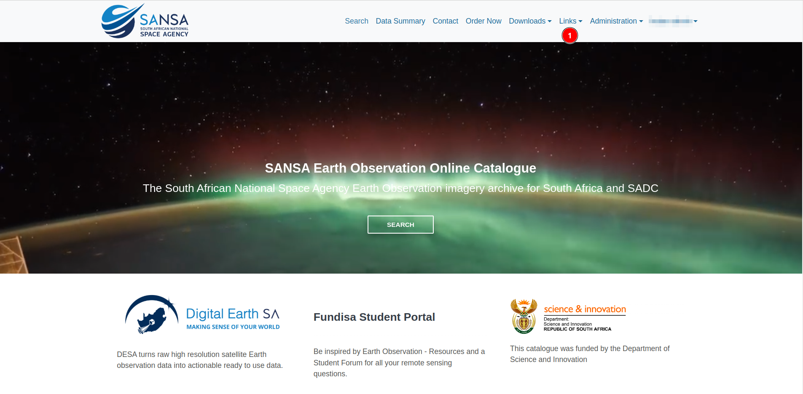

# Links

1. **Links:** Users can explore a variety of links by clicking on the `Links` option in the top navigation bar, which will open a dropdown menu containing multiple links.

    

    * **[SANSA](https://www.sansa.org.za/):** This link redirects to the `SANSA` website.
    * **[DESA](https://desa.sansa.org.za/):** This link redirects to the `DESA` website.
    * **[Decision support tool](http://products.sansa.org.za/mapApp/index.html):** This link redirects to the decision support tool.
    * **[Mzansi Amanzi](https://water-southafrica.co.za/):** This link redirects to the `Mzansi Amanzi` website.
    * **[Fundisa](http://fundisa.sansa.org.za/):** This link redirects to the `Fundisa` website.
    * **[Remote sensing Atlas](http://atlas.sansa.org.za/):** This link redirects to the remote sensing atlas.
    * **[SA-GEO SA-GEO | NEOSS](https://neoss.co.za/):** This link redirects to the `NEOSS` website.
    