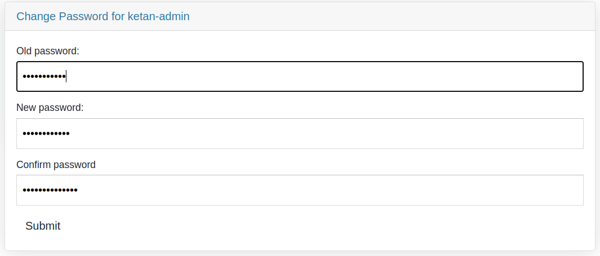
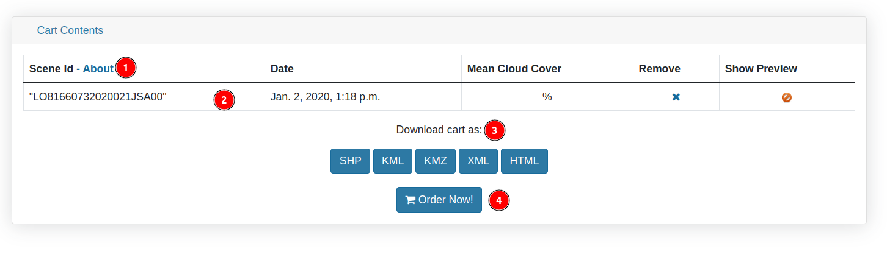

# Profile Page

1. **Username:** Users need to click on their name in the navigation bar to open a dropdown menu with following options:

    

    * **Profile:** Redirects users to their profile page.

    * **Logout:** Logs out the user.

1. **Profile:** This tab allow users to access the profile information. This tab is selected by default.

    

    **1 Profile:** Users can various options such as `Edit profile`, `Change e-mail address` and `Change password` from this section.

    * **Edit profile:** Users can use this option to edit their profile information. Clicking on it will open a form where users can update their details. After filling in the required information, scroll down and click the `Save Changes` button to apply the updates.

        

        * After saving the changes, updated information will be reflected on the profile page.

            

    * **Change e-mail address:** Users can use this option to change their e-mail address.

        

        **1. Input Field:** Users are required to enter their email here.

        **2. Send Confirmation:** After entering the email click on this button submit the request.

    * **Change password:** Users can use this option to change their password.

        

        * **Old password:** Enter old password.
        * **New password:** Enter new password.
        * **Confirm Password:** Enter new password again.
        * **Submit:** After filling in all the fields click on this button to submit the request.

    **2 Account Details:** Users can view their account details in this section. However, they cannot edit any fields, they can only view the information.

2. **Cart:** By clicking on this tab users can view the information related to the cart.

    

    **1 About:** User can click on this option to view the information related to the that particular scene. This will redirects the users to the scene page.

    **2 Table:** Users can view the items currently available in their cart.

    **3 Download cart as:** Users can download the cart information in various formats such as SHP, KML, XML, etc.

    **4 Order Now:** By clicking on this button users will be redirects to the add order page from where they can add new order.

    
    

    ## Order Options  
    
    Users must configure the following options before placing an order: 

    **Projection**  
    - Choose between `UTM` or `Geographic` projection.  
    - Click `Apply` to confirm the selection. 

    **Processing Level**  
    - Options include:  
      - `Raw`  
      - `Standard default` (selected by default)  
    - Click `Apply` to confirm the selection.

    **Datum & File Format**  
    - Select `Datum`: Default is `WGS84` from the dropdown menu.  
    - Choose `File format`: Default is `GeoTIFF` from the dropdown menu.

    **Delivery Method & Market Sector**  
    - Select a `Delivery method` (e.g., `CD/DVD`) from the dropdown menu.  
    - Choose a `Market sector` from the dropdown menu.

    **Subsidy Type**  
    - Select `Subsidy type requested` (e.g., `Institution Research`) from the dropdown menu.  
    - The assigned user and subsidy type appear below.

    **Uses of the Data**  
    - Users must specify the intended use of the data. 

    **Notes**  
    - Additional comments or instructions can be entered in the provided text box.  

    ## Product Details  
    - The table displays the selected product details:  
      - **Product name**  
      - **Date** of acquisition  
      - **Cloud cover percentage**  
      - **Projection type**  
      - **Processing level**  
      - **Cost (if applicable)** 
      - Users can remove an item by clicking the .

    **Placing the Order**  
    - After configuring all options, click the `Order Now` button to finalize the request.

3. **Order:** Allows users to access the order information.

    

    **1 Download as PDF:** Users can download the order information as a PDF document.

    2. **Go:** Users can search for any order by entering the name of the order in the search field then click on this `Go` button to search.

4. **Search History:** This tab allows users to view their search history.

    

    * ** Icon:** Users can use this icon to search that record on the map.

        

    * **:** Allows users to remove the record from the search history.
