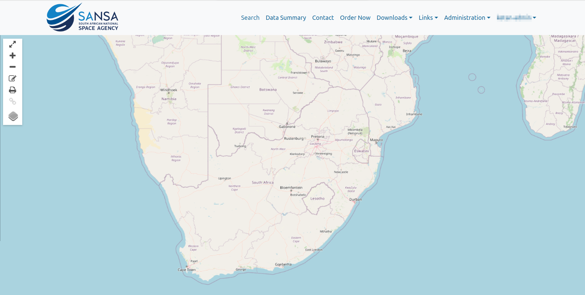
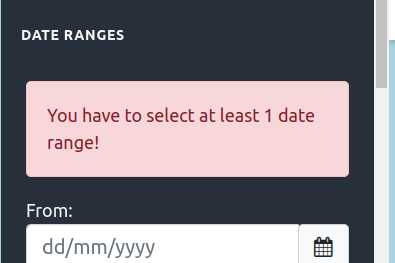

# Search Page

1. **Search:** By clicking on this link users will be able to access the search page.

2. **SEARCH:** Alternatively users can use this button access the search page.

1. ** Icon:** Users can use this icon to hide/show the parameters, although this is show by default.

    

2. ** Icon:** By clicking on this icon, users can zoom in on the map.

3. ** Icon:** By clicking on this icon, users can zoom out on the map.

4. ** Icon:** By clicking on this icon, users can draw on the map.

5. ** Icon:** By clicking on this icon, users can print the map. After clicking on the icon, the map will be downloaded in `PNG` format.

    

6. ** Icon:** Users can copy the link (if available) by clicking on this icon.

7. ** Icon:** Users can use this button change the type of the map.

    

    * **OpenStreetMap:** This is the default map type. OpenStreetMap (OSM) is a collaborative mapping project that provides freely accessible and editable geographic data. It is built by a global community of volunteers who contribute and maintain map data for public use.

        

    * **Tone:** This map type is used for visualizing the data in a tone map.

    * **Topography:** Topography refers to the detailed mapping and study of the Earth's surface features, including mountains, valleys, plains, and bodies of water. It helps in understanding elevation, terrain shapes, and landforms, often represented through contour lines on maps.

        

## Apply Parameters

1. **SATELLITES:** Users can select the type of satellite by checking the respective checkboxes. If they want to choose a specific satellite, they can select it from the dropdown menu. If users do not select a specific satellite, all satellites will be selected by default.

2. **DATE RANGES:** Users are required to select the `From` and `To` dates from the calendar.

    

    * If users click on the `APPLY` button without specifying the dates, they will encounter the following error.

        

    * If users click on the `Add` button without selecting the either dates, they will encounter the following error.

        

3. **Add:** After selecting the dates click in this button, this will add those date into the below input.

1. **From/To Dates:** These dates are automatically added when user clicks on the `Add` button. To remove the dates click on the `x` icon. Users can select multiple dates.

    

2. **Others:** Users can use these options to add some more filters to the data.

3. **RESET:** Use this button to reset the form.

4. **APPLY:** To apply the filter click on this apply button.

    

    * Users will get the above alert message if no results were found.

1. ** Icon:** Users can use this button to hide the data.

2. ** Icon:** Users can use this icon to open explore the metadata of the result set.

    

## Draw Polygon

1. ** Icon:** By clicking on this, users will be able to draw a polygon. After clicking on this icon, they need to mark points on the map, and to complete the drawing, they must click on the first point. After drawing the polygon users will also be able to copy the link using the  icon.

    

* After completing the editing, the `Draw Polygon` changes to `Delete Polygon`.

    
