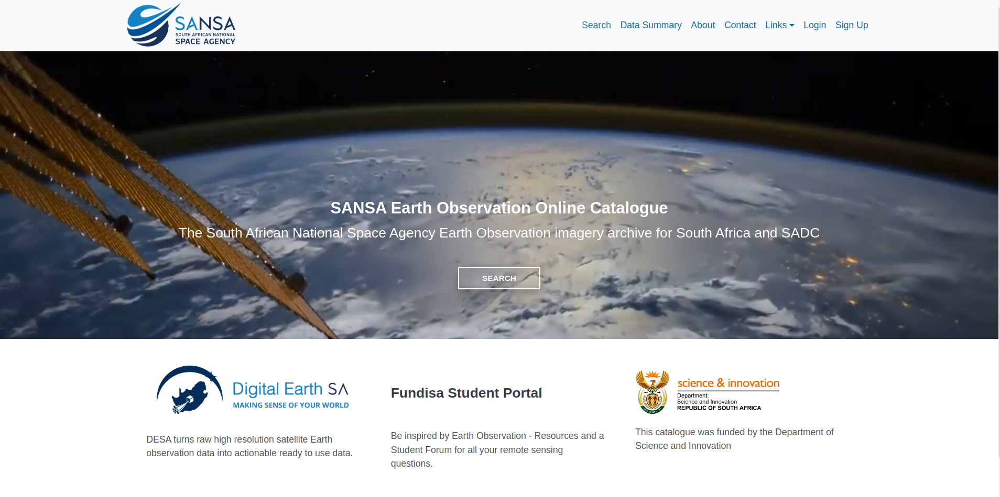

# Quickstart

## Accessing the Platform

Navigate to the [Home Page](http://catalogue.sansa.org.za/) of the site, where you will be greeted by the landing page.

## Registration and Logging In

Click on the `Sign Up` button in the top navigation bar to be redirected to the sign-up page.

Fill in all the required details in the sign-up form, including your name, email, and password, then click on `SIGN UP` to complete the process. 

## Logging in

Click on the `Login` button in the top navigation bar to be redirected to the login page.

Fill in you email address and password you have used at the time of registration in the login form then click on the `Login` button. 

After submitting the form you will be redirected to the search page of the website.

